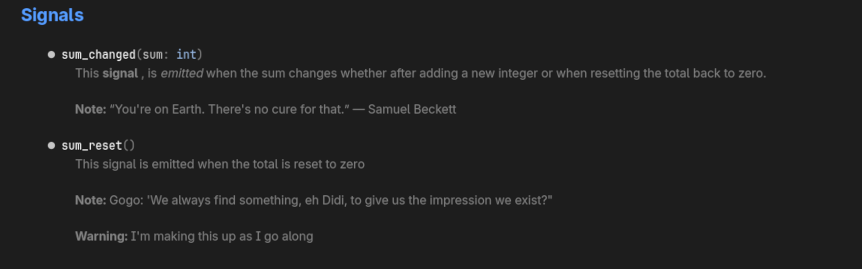
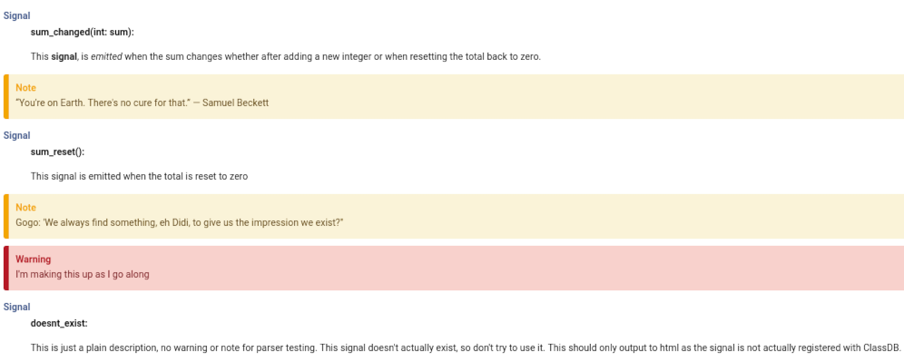
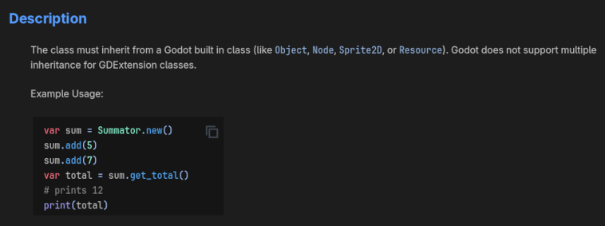

IMPORTANT
=========

Update:
-------
For the most part the model can serialize / deserialize to and from XML and JSON, and should now be fully working.

Then I'll integrate the new models with Eurus, and start on finishing up the remaining items to generate
class documentation from source code.

Sample model usage can be found [here](./docs/doc_model.md)

Same for [PoozosNotus](docs/poozo.md) which now handles all the source code parsing.  At this point it is almost finished but still has some quirks.


Current Known Bugs:
-------------------
Code blocks are currently formatted incorrectly if they contain tabs as someone ignored white space markup when
writing the parser for code blocks. 

Description:
============
Some python scripts based off the Godot GDExtension cpp [template](https://github.com/godotengine/godot-cpp-template)
structure and build system to generate Godot class documentation from Doxygen generated XML.

While this project's source code is unlicensed, the doxygen.py module is not my work and is licensed
under the GNU Lesser General Public License version 2.1.  A copy of said license has been provided in the support directory.
This module can be used when using scons to build the Doxygen XML.  

The project now includes portions of the class.xsd file in the documentation.  These portions are derived from Godot's 
main source repository and are distributed under the MIT license, and attributed to "Juan Linietsky, Ariel Manzur and 
the Godot community.

Current Status: BETA
===================================
Currently, the source code parser [PoozoNotus](docs/poozo.md) can extract methods, enum constants, integer constants, properties
and signals.
AFAIK these all now export properly to the Godot documentation format.  

In some cases the source code parser may fail, or may encounter something it doesn't recognize yet like GDVirtual.  
If this happens, instructions to merge missing elements can be found [here](docs/merge_missing.md).

Processing of code blocks in description fields almost working (see bug above), see [Codeblocks](#codeblocks).

Contents:
=========
This repository contains 4 python modules:

- luckys_zephyr.py : contains LuckyZephyr class that parses and searches the Doxygen XML, this class is used by the above to parse the source XML
- poozos_notus.py contains [PoozosNotus](docs/poozo.md) class to parse cpp source code containing binding declarations for a GDExtension 
- aerify_did.py : script to generate Godot class documentation using LuckyZephyr to query the Doxygen XML and PoozosNotus to scrape the source code.
- waft_gogo.py : script to generate a build profile based on include statements, using LuckyZephyr to parse the Doxygen XML

The example directory has a self-contained example to represent parts of a GDExtension cpp template project.  It has
no requirement other than python, and contains command line scripts that demonstrate usage.

The example directory has a README with more information.

The support_files directory contains a sample cmake file for configuring Doxygen
and running the scripts as part of a cmake target.

The support files directory also contains Doxygen configuration file with
all the aliases already in it.  This can then be used from the command line to generate the
Doxygen XML so that the scripts can be used manually, or integrated into the scons build system via the doxygen.py module.

To see an example project using cmake with the scripts to generate Godot class documentation see 
[doxy_demo](https://github.com/silenuz/doxy_demo)

The Scripts:
============
Information about how the scripts work will eventually be here.  

Information about basic usage of the poozo_notus module can be found [here](docs/poozo.md).

Notes:
======
This section contains notes pertaining to how the Doxygen XML is parsed into the Godot class documentation.

Signals:
--------
Signal information is now output to the class documentation and the Doxygen XML parser expects the information to be part of the
detailed description for the class.  If it can find signal reference items in the class' detailed description, it will output 
those descriptions, otherwise it will simply generate the signal content with an empty description much the same as doctool would.

Unlike properties which have a backing field to parse content for, signals don't necessarily have a physical presence in the file,
so to provide the information to Doxygen the signal alias is used.  It takes two arguments, the name of the signal, and the description.
Unlike the other aliases the signal alias uses a pipe as the argument seperator so that commas in the description do not have to
escaped.  

The name can be the full signature ```sum_changed(int: sum)``` or just the name ```sum_changed```.  The name
here is what shows up in the other output formats, so if your generating html or other formats for in-house documentation
using the full signature is recommended.  

The description contains the description and any notes and or warnings using the standard @note and @warning Doxygen commands.
Currently, there is a bug in the xml parser where it will only read 1 paragraph for the description.  So only the first paragraph of the 
second argument will be read into the description, however it is fine to have a paragraph break between the description and any note or warning.

Sample:

```c++
 * @signal{sum_changed(int: sum)|
 * This **signal**, is _emitted_ when the sum changes whether
 * after adding a new integer or when resetting the total back to zero.
 *
 * @note “You're on Earth. There's no cure for that.” ― Samuel Beckett  }
 *
 * @signal{sum_reset()| This signal is emitted when the total is reset to zero
 * @note Gogo: 'We always find something, eh Didi, to give us the impression we exist?"
 * @warning I'm making this up as I go along }
 *
 * @signal{doesnt_exist|This is just a plain description, no warning or note for parser testing.  This signal
 * doesn't actually exist, so don't try to use it.  This should only output to html as the signal is not actually registered
 * with ClassDB.}
```
Editor Signal Output:



Html Signal Output:



CodeBlocks:
-----------
When providing code block examples, to have them parsed correctly it is important 
not to break up individual code blocks that are to be part of a codeblocks example.
If there is a blank line between the code examples two individual code blocks will be created.

However, I don't see the point of including csharp examples in [codeblocks] as they never display in the editor anyway.
If your using gd script it doesn't display and if using csharp the documentation isn't even available.  
Even if you go to the [class documentation reference](https://docs.godotengine.org/en/stable/engine_details/class_reference/index.html#formatting-code-blocks)
and copy and paste the code blocks example it only displays the gdscript portion.  If you violate the reference guide and put
the csharp example first, it's still only the gdscript example that displays in the editor. 

"The hardest thing of all is to find a black cat in a dark room, especially if there is no cat"

For example the following code comments:
```cpp
 * The class must inherit from a Godot built in class (like @glnk{Object}, @glnk{Node}, @glnk{Sprite2D}, or @glnk{Resource}).
 * Godot does not support multiple inheritance for GDExtension classes.
 *
 *  Example Usage:
 *
 *  \code{.csharp}
 *	GodotObject sum = ClassDB.Instantiate("Summator").As<GodotObject>();
 *	sum.Call("add",5);
 *	sum.Call("add",7);
 *	int total = sum.Call("get_total").As<int>();
 *	// prints 12
 *	GD.Print(total);
 *  \endcode
 *	\code{.gdscript}
 *  var sum = Summator.new()
 *	sum.add(5)
 *	sum.add(7)
 *	var total = sum.get_total()
 *	# prints 12
 *	print(total)
 * \endcode
```
produces this output:
```xml
  <description>The class must inherit from a Godot built in class (like [Object], [Node], [Sprite2D], or [Resource]). Godot does not support multiple inheritance for GDExtension classes. [br] [br] Example Usage: [codeblocks][gdscript]var sum = Summator.new()
sum.add(5)
sum.add(7)
var total = sum.get_total()
# prints 12
print(total)
[/gdscript][csharp]GodotObject sum = ClassDB.Instantiate( "Summator" ).As&lt;GodotObject&gt;();
sum.Call( "add" ,5);
sum.Call( "add" ,7);
int total = sum.Call( "get_total" ).As&lt; int &gt;();
// prints 12
GD.Print(total);
[/csharp][/codeblocks]</description>
```
Note the gdscript was rearranged to be first in the codeblocks markup.  If there is a new paragraph (blank line)
between code blocks then a separate code block will be created for each.  Here's how it looks in the editor:


Other Aliases:
--------------
There are multiple predefined aliases for Doxygen.  the definitions for these aliases can be found in
the [doxygen_aliases](support_files/doxygen_aliases.txt) file, this file is used in the example project to
generate the Doxygen configuration. These aliases can be used to insert Godot specific elements into the Doxygen XML 
output that will be ignored by other document generators like Breathe that work with the Doxygen XML output.  
This output is also ignored when producing html, latex, or man pages documentation.

The simplest of these aliases is the class linker.  

Here's part of [TrafficLight.h](/src/traffic_light.h) showing the class linker ```@glnk{Class}```
```
* The class <u>must inherit</u> from a Godot built in class (like @glnk{Object}, @glnk{Node}, @glnk{Sprite2D}, or @glnk{Resource}).
* Godot does not support multiple inheritance for GDExtension classes.
```

Generates this html:


But generates this class documentation:
```
The class [u]must inherit[/u] from a Godot built in class (like [Object], [Node], [Sprite2D], or [Resource]). Godot does not support multiple inheritance for GDExtension classes.
```
Which looks like this in the Godot editor:


 Aliases:

| Alias  | Action                          | Parameters | Example                    | Godot Output             | Standard Output       |
|--------|---------------------------------|------------|----------------------------|--------------------------|-----------------------|
| glnk   | Link to class                   | 1          | @glnk{class}               | [class]                  | class                 |
| gdcon  | Link to constant                | 2          | @gdcon{class,name}         | [constant class.name]    | name                  |
| gdenu  | Link to enum                    | 2          | @gdenu{class,name}         | [enum class.name]        | name                  |
| gdmem  | Link to member                  | 2          | @gdmem{class,name}         | [member class.name]      | name                  |
| gdmet  | Link to method                  | 2          | @gdmet{class,name}         | [method class.name]      | name                  |
| gdnew  | Link to built-in constructor    | 2          | @gdnew{class,name}         | [constructor class.name] | name                  |
| gdope  | Link to built-in operator       | 2          | @gdope{class,name}         | [operator class.name *]  | name                  |
| gdsig  | Link to signal                  | 2          | @gdsig{class,name}         | [signal class.name]      | name                  |
| gdthe  | Link to theme item              | 2          | @gdthe{class,name}         | [theme_item class.name]  | name                  |
| gdpar  | Parameter name as code          | 1          | @gdpar{name}               | [param name]             | name                  |
| signal | Creates a signal reference item | 2          | @signal{name\|description} | signal description       | signal reference item |
