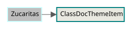

# ClassDocThemeItem
Module: argestes.class_doc_theme_item



This class represents a model of the class doc's theme_item element


## Attributes / Parameters:

| Type | Name | Default |
| --- | --- | --- |
| str | [name](#name) |  |
| str | [text](#text) | None |
| str | [data_type](#data_type) | None |
| str | [type_value](#type_value) | None |
| str | [default](#default) | None |
| str | [keywords](#keywords) | None |
| str | [deprecated](#deprecated) | None |
| str | [experimental](#experimental) | None |

## Methods:

| Return | Name |
| --- | --- |
| None | __init__ |  |
| dict | to_dict |  |
| xml.etree.ElementTree.Element | to_xml_doc |  |

## Attribute Descriptions:

### name

 The value of the name attribute for the theme_item element.
### text

 The value of the text attribute for the theme_item element.
### data_type

 The value of the data_type attribute for the theme_item element.
### type_value

 The value of the type attribute for the theme_item element.
### default

 The value of the default attribute for the theme_item element.
### keywords

 The value of the keywords attribute for the theme_item element.
### deprecated

 The value of the deprecated attribute for the theme_item element.
### experimental

 The value of the experimental attribute for the theme_item element.

## Method Descriptions:

### __init__

Not Documented Yet
### to_dict

Returns a dictionary of the values for this theme_item element model instance.

:return: a dictionary of values for this theme_item model instance.
### to_xml_doc

Create a Godot class doc element for this theme_item model instance.

:return: A Godot class doc element for this theme_item model instance.
## Schema

The following schema definition is derived from Godot's main source repository, and is distributed under the MIT license.

Attribution: Juan Linietsky, Ariel Manzur and the Godot community

```xml
<xs:element  name="theme_item" maxOccurs="unbounded" minOccurs="0">
    <xs:complexType>
        <xs:simpleContent>
            <xs:extension base="xs:string">
                <xs:attribute type="xs:string" name="name"></xs:attribute>
                <xs:attribute type="xs:string" name="data_type"></xs:attribute>
                <xs:attribute type="xs:string" name="type"></xs:attribute>
                <xs:attribute type="xs:string" name="default" use="optional"></xs:attribute>
                <xs:attribute type="xs:string" name="deprecated" use="optional"></xs:attribute>
                <xs:attribute type="xs:string" name="experimental" use="optional"></xs:attribute>
                <xs:attribute type="xs:string" name="keywords" use="optional"></xs:attribute>
            </xs:extension>
        </xs:simpleContent>
    </xs:complexType>
</xs:element>
        
```