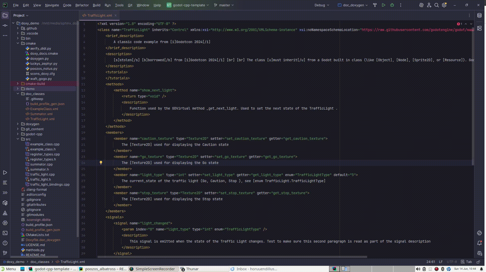

Due to some parser limitations, like the inability to understand GDVirtual yet, or that comments in multiline 
declarations that include a closing bracket may result in incomplete or skipped information, depending on 
where the bracket is, or other currently unforeseen problems, the output documentation may be missing content.

If this happens, simply use doctools to merge in the missing elements and or tags.  First build the GDExtension, so
that the shared library for the extension exists in the Godot project.

Next open the Godot project in a terminal, and use Godot to merge in the missing information:

```shell
godot  --doctool ../ --gdextension-docs
```
