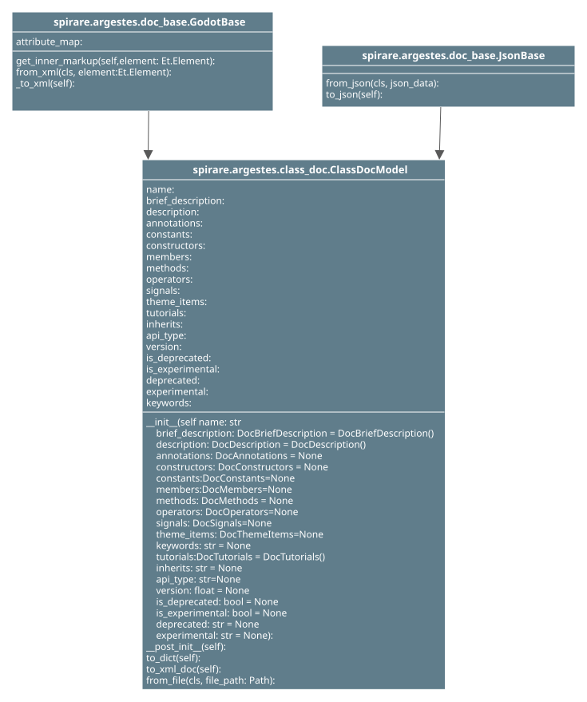

# Module: `argestes.class_doc`

@Project: poozos_albatross
@Date: 6/19/26
@File: doc_class

@Author: Silenuz Nowan (silenuznowan@yahoo.com)

## 📦 Class: `ClassDocModel`

This class represents a model of the root class element of the Godot doc xml.

* param str name: The value of the name attribute for this class element.
* param DocBriefDescription brief_description: The value of the brief_description element for this class element.
* param DocDescription description: The value of the description element for this class element.
* param DocAnnotations annotations: The value of the annotations element for this class element.
* param DocConstants constants: The value of the constants element for this class element.
* param DocConstructors constructors: The value of the constructors element for this class element.
* param DocMembers members: The value of the members element for this class element.
* param DocMethods methods: The value of the methods element for this class element.
* param DocOperators operators: The value of the operators element for this class element.
* param DocSignals signals: The value of the signals element for this class element.
* param DocThemeItems theme_items: The value of the theme_items element for this class element.
* param DocTutorials tutorials: The value of the tutorials element for this class element.
* param str inherits: The value of the inherits attribute for this class element.
* param str api_type: The value of the api_type attribute for this class element.
* param float version: The value of the version attribute for this class element.
* param bool is_deprecated: The value of the is_deprecated attribute for this class element.
* param bool is_experimental: The value of the is_experimental attribute for this class element.
* param str deprecated: The value of the deprecated attribute for this class element.
* param str experimental: The value of the experimental attribute for this class element.
* param str keywords: The value of the keywords attribute for this class element.

## 📦 Class: `ExtensionDocModel`

